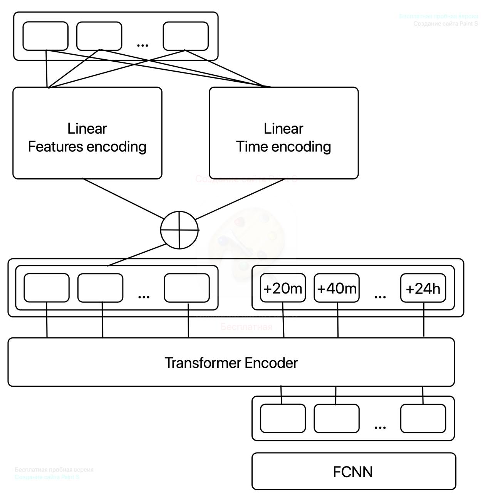

# **Локальный метеопрогноз на основе реальных измерений с метеостанций**
Данный проект реализует решение, которое позволяет сделать прогноз метеопараметров на ближайшие 24 часа

## Установка и запуск проекта
1. **Склонируйте репозиторий:** git clone https://git.truetecharena.ru/sistema-xak-tomsk-18/truetecharena1747715571-team-12923/rabochij-prototip-kod-i-dokumentaciya-198.git
2. **Установите все необходимые библиотеки из файла requirements.txt:** pip install -r requirements.txt
3. **Перейдите в папку:** cd rabochij-prototip-kod-i-dokumentaciya-198
4. **Запустите проект:** python service.py 

## Структура проекта
```text
rabochij-prototip-kod-i-dokumentaciya-198
├── pycache                  # Скомпилированные Python-файлы (автоматически создаются интерпретатором)
├── models/                       # Сохранённые модели│
├── researches/                   # Исследовательские ноутбуки
├── 20250522_023022_month.csv     # Основной CSV-файл с данными для обучения
├── fft_function.py              # Скрипт с функциями преобразования Фурье
├── inference.py                 # Скрипт инференса модели 
├── instruction.txt              # Текстовый файл с инструкцией по развертыванию
├── model.pth                    # Файл обученной модели для предсказания температуры, влажности, давления
├── model2.pth                   # Файл обученной модели для предсказания ветра
├── model.py                     # Архитектура нейросети
├── post_training.py             # Скрипт дообучения модели или анализа после тренировки 
├── preprocessing.py             # Предобработка данных
├── README.md                    # Описание проекта, инструкция по запуску
├── requirements.txt             # Список зависимостей для установки
├── run.py                       
├── service.py                   # Сервис
├── torch_utils.py               # Пользовательские датасеты и вспомогательные классы для PyTorch
└── train_loop.py                # Основной цикл обучения, валидации и метрики
``` 

## Архитектура нейронной сети


## Состав команды
1. Степан Шепилов - капитан, ML-Инженер
2. Егор Кошелев - ML-Инженер
3. Максим Старпештес - ML-Инженер
4. Пётр Колесов - ML-Инженер, python dev
5. Николай Михайлов - ML-Инженер
6. Екатерина Семёнова - ML-Инженер

## Рекомендуемые характеристики
1. Операционная система: Windows7+ / macOS X+
2. Процессор: 1-ядерный CPU
3. Оперативная память: 2 ГБ
4. Python: версия 3.9+